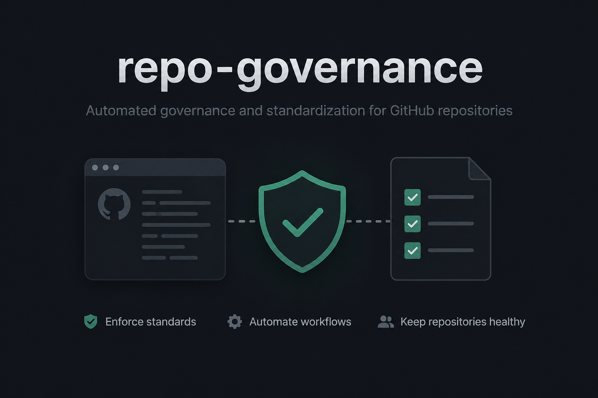

# repo-governance



Reusable repository governance tooling for Heúrema projects.

The first tool is **PR Intake Gate**: a deterministic GitHub Action that lets trusted maintainers move fast while requiring stronger intake checks for outside contributors.

The second tool is **Codex Review Gate**: a read-only GitHub Action that fails when active Codex Review inline threads are unresolved, so teams do not need to remember to inspect automated review conversations manually.

## What PR Intake Gate does

For each pull request it decides whether ordinary review can proceed:

- trusted repo authors with `admin`, `maintain`, or `write` permission pass automatically;
- external PRs touching high-risk paths fail until a maintainer handles them;
- tiny docs-only/trivial external PRs can pass directly;
- non-trivial external PRs must explain the problem, timing, existing options, alternatives, no-code option, why code is needed, and linked intent;
- maintainers can use `intake/accepted-for-pr` for non-high-risk external PRs;
- maintainers can use `maintainer/override-intake` when they explicitly accept responsibility for bypassing intake.

## Security model

The action is designed for `pull_request_target`.

Required rules:

1. Checkout only the trusted base commit.
2. Read local policy from the trusted base checkout.
3. Never checkout, import, install, or execute PR head code.
4. Use GitHub REST API for PR metadata, changed files, labels, and comments.
5. Pin third-party actions and pin this action by protected tag or commit SHA in mature repos.

## Quick start in a target repo

From the target repository root:

```bash
mkdir -p .github/workflows
python3 /path/to/repo-governance/scripts/render_repo_policy.py \
  --project-name "Project Name" \
  --output .github/pr-intake-gate.yml
cp /path/to/repo-governance/templates/workflows/pr-intake-gate.yml \
  .github/workflows/pr-intake-gate.yml
```

Then edit `.github/pr-intake-gate.yml` for the target repo.

Minimum required tuning:

- `project.name`
- `trivial.allowed_path_globs`
- `high_risk_path_globs`
- `external_context.required_sections`
- `linked_intent.accept_patterns`
- `bot_comment.marker`

Add the sections from `templates/pull-request-template-sections.md` to the repo's PR template.

## Workflow template

The target repo should have `.github/workflows/pr-intake-gate.yml`:

```yaml
name: PR Intake Gate

on:
  pull_request_target:
    types: [opened, edited, reopened, synchronize, labeled, unlabeled]

permissions:
  contents: read
  pull-requests: write
  issues: write

jobs:
  pr-intake-gate:
    name: pr-intake-gate
    runs-on: ubuntu-24.04
    timeout-minutes: 10

    steps:
      - name: Checkout trusted base code
        uses: actions/checkout@34e114876b0b11c390a56381ad16ebd13914f8d5
        with:
          ref: ${{ github.event.pull_request.base.sha }}
          persist-credentials: false

      - name: Run PR intake gate
        uses: heurema/repo-governance/actions/pr-intake-gate@v0.1.0
        with:
          policy-path: .github/pr-intake-gate.yml
          github-token: ${{ secrets.GITHUB_TOKEN }}
```

For stricter supply-chain control, replace `@v0.1.0` with a commit SHA after testing.

## Codex Review Gate workflow

To make unresolved Codex Review conversations visible as a required check, add `.github/workflows/codex-review-gate.yml` from `templates/workflows/codex-review-gate.yml`.

The check fails when an active unresolved review thread has a comment from `chatgpt-codex-connector`. It ignores outdated threads by default and does not write labels or comments.

After the workflow has run once on the default branch, require status check:

```text
codex-review-gate
```

In mature repos, pin the action reference to a commit SHA.

## Policy example

Use `templates/pr-intake-gate.yml` as the generic starter.

Reference policies:

- `examples/goalrail.pr-intake-gate.yml`
- `examples/signum.pr-intake-gate.yml`
- `examples/punk.pr-intake-gate.yml`

## Label bootstrap

The action can create missing labels lazily, but explicit bootstrap is clearer:

```bash
python3 scripts/install_labels.py \
  --repo owner/name \
  --policy /path/to/target/.github/pr-intake-gate.yml \
  --dry-run

GITHUB_TOKEN="$GITHUB_TOKEN" \
python3 scripts/install_labels.py \
  --repo owner/name \
  --policy /path/to/target/.github/pr-intake-gate.yml
```

## Audit local repos

```bash
python3 scripts/audit_repos.py --root /Users/vi/personal/heurema
python3 scripts/audit_repos.py --root /Users/vi/personal/heurema --only-missing
python3 scripts/audit_repos.py --root /Users/vi/personal/heurema --format csv > repo-gate-audit.csv
```

## Test

```bash
python3 tests/test_pr_intake_gate.py
python3 tests/test_codex_review_gate.py
```

## Docs

- `docs/POLICY.md` - PR Intake Gate policy reference and decision order.
- `docs/CODEX_REVIEW_GATE.md` - Codex Review Gate behavior and rollout notes.
- `docs/ROLLOUT.md` - step-by-step rollout guide for target repositories.
- `AGENTS.md` - detailed operating instructions for coding agents.
