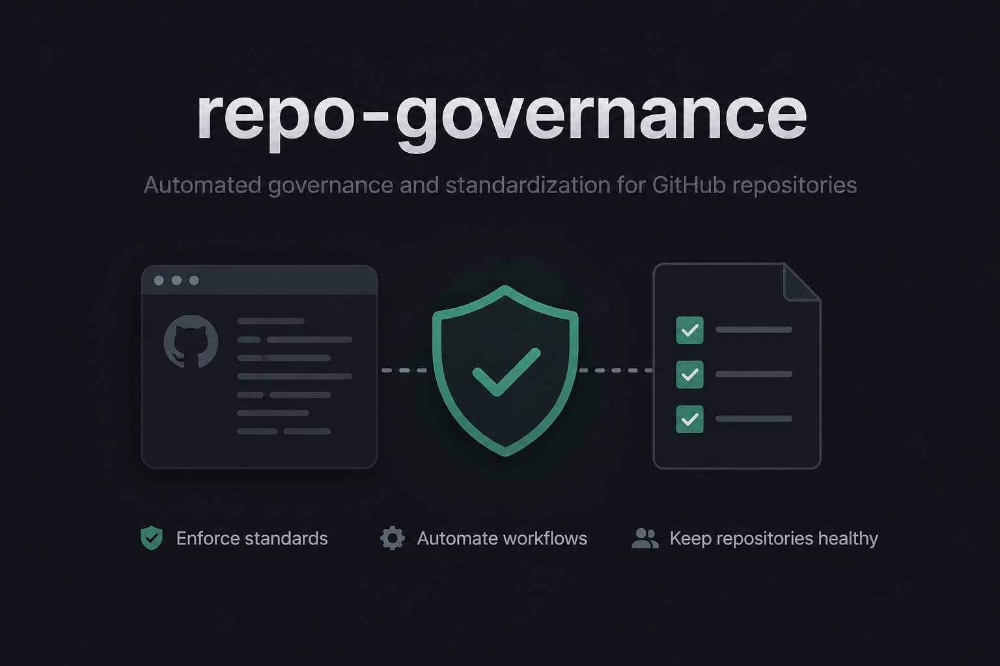

# repo-governance



Reusable repository governance tooling for Heúrema projects.

The first tool is **PR Intake Gate**: a deterministic GitHub Action that lets trusted maintainers move fast while requiring stronger intake checks for outside contributors. It also runs the read-only Codex Review Gate by default, so one required `pr-intake-gate` check can block unresolved Codex Review threads that already exist.

The second tool is **Codex Review Gate**: a standalone read-only GitHub Action that fails when active Codex Review inline threads are unresolved, for repos that want a separate named check.

The third tool is **Codex Review Ready**: a state-based commit-status reconciler. It writes `codex-review-ready` as `pending` until Codex has produced a current-head review signal or an existing clean `+1` has survived the grace window, `failure` while active Codex threads remain unresolved, and `success` when the PR is clear.

## What PR Intake Gate does

For each pull request it decides whether ordinary review can proceed:

- trusted repo authors with `admin`, `maintain`, or `write` permission pass automatically;
- external PRs touching high-risk paths, AI instruction surfaces, or suspicious prompt-injection-like additions fail until a maintainer handles them;
- tiny docs-only/trivial external PRs can pass directly;
- non-trivial external PRs must explain the problem, timing, existing options, alternatives, no-code option, why code is needed, and linked intent;
- maintainers can use `intake/accepted-for-pr` for non-high-risk external PRs;
- maintainers can use `maintainer/override-intake` when they explicitly accept responsibility for bypassing intake.

## Security model

The action is designed for `pull_request_target`.

Required rules:

1. Checkout only the trusted base commit.
2. Read local policy from the trusted base checkout.
3. Never checkout, import, install, or execute PR head code.
4. Use GitHub REST API for PR metadata, changed files, labels, and comments.
5. Pin third-party actions and pin this action by protected tag or commit SHA in mature repos.

## Quick start in a target repo

From the target repository root:

```bash
mkdir -p .github/workflows
python3 /path/to/repo-governance/scripts/render_repo_policy.py \
  --project-name "Project Name" \
  --output .github/pr-intake-gate.yml
cp /path/to/repo-governance/templates/workflows/pr-intake-gate.yml \
  .github/workflows/pr-intake-gate.yml
```

Then edit `.github/pr-intake-gate.yml` for the target repo.

Minimum required tuning:

- `project.name`
- `trivial.allowed_path_globs`
- `high_risk_path_globs`
- `instruction_surface.path_globs`
- `prompt_injection.text_path_globs`
- `external_context.required_sections`
- `linked_intent.accept_patterns`
- `bot_comment.marker`

Add the sections from `templates/pull-request-template-sections.md` to the repo's PR template.

## Workflow template

The target repo should have `.github/workflows/pr-intake-gate.yml`:

```yaml
name: PR Intake Gate

on:
  pull_request_target:
    types: [opened, edited, reopened, synchronize, labeled, unlabeled, ready_for_review]

permissions:
  contents: read
  pull-requests: write
  issues: write

jobs:
  pr-intake-gate:
    name: pr-intake-gate
    runs-on: ubuntu-24.04
    timeout-minutes: 20

    steps:
      - name: Checkout trusted base code
        uses: actions/checkout@34e114876b0b11c390a56381ad16ebd13914f8d5
        with:
          ref: ${{ github.event.pull_request.base.sha }}
          persist-credentials: false

      - name: Run PR intake gate
        uses: heurema/repo-governance/actions/pr-intake-gate@v0.3.0
        with:
          policy-path: .github/pr-intake-gate.yml
          github-token: ${{ secrets.GITHUB_TOKEN }}
          codex-review-require-current-review: 'false'
          codex-review-wait-seconds: '0'
          codex-review-resolution-wait-seconds: '480'
          codex-review-poll-interval-seconds: '10'
```

For stricter supply-chain control, replace `@v0.3.0` with a commit SHA after testing. Existing repositories pinned to an older SHA must update that SHA to receive newer central gate behavior.

## Codex Review Ready workflow

Use `codex-review-ready` as the required pre-merge Codex completion barrier. It is separate from `pr-intake-gate` because `pr-intake-gate` writes labels/comments and should stay on write-capable `pull_request_target` events only.

Copy `templates/workflows/codex-review-ready.yml` into the target repo and pin the action reference. After it runs once on the default branch, require this status context:

```text
codex-review-ready
```

The reconciler writes a commit status on the PR head. Event runs poll for up to 30 minutes and exit as soon as Codex is ready. A 5-minute scheduled run heals states that GitHub Actions cannot trigger directly, especially PR `+1` reactions and review-thread resolution. Because GitHub issue reactions are one-per-user per PR body, an older Codex `+1` can satisfy readiness after a bounded grace window when no active Codex threads remain unresolved.

When the status is `failure`, agents should open the run summary, fix or verify
each linked Codex finding, push code changes when needed, and resolve the linked
GitHub review conversations. An outdated conversation is not automatically a
resolved conversation; external conversation-resolution gates may still require
`isResolved=true`.

Required permissions:

```yaml
permissions:
  contents: read
  issues: read
  pull-requests: read
  statuses: write
```

## Codex Review Gate workflow

`actions/pr-intake-gate` runs Codex Review Gate by default. In bundled mode, the recommended configuration blocks active unresolved Codex Review threads but does not require a separate current-head Codex Review completion signal. Use `codex-review-ready` for that completion signal.

After Codex reports findings, fixing code is not always enough. Resolve the linked GitHub review conversations, or push a new commit that makes stale diff threads outdated. Repositories with GitHub branch protection conversation resolution enabled will also block merge until those conversations are resolved.

GitHub Actions does not trigger a workflow when a review thread is resolved. The
recommended workflow keeps the gate running for a bounded
`codex-review-resolution-wait-seconds` window, then polls GitHub until the
threads are resolved or outdated. After that window expires, a manual rerun or a
new push is still required for the thread-only check. The `codex-review-ready`
status also has a scheduled healing pass and is the preferred required
pre-merge barrier.

Keep `pr-intake-gate` on `pull_request_target` events. It writes labels and comments, so running it from `pull_request_review` or `pull_request_review_comment` can give fork and Dependabot PRs a read-only token and turn review activity into a false gate failure.

To make unresolved Codex Review conversations visible after review activity, add the read-only standalone `.github/workflows/codex-review-gate.yml` from `templates/workflows/codex-review-gate.yml` and require that status context separately.

The check fails when an active unresolved review thread has a comment from `chatgpt-codex-connector`. It ignores outdated threads by default and does not write labels or comments.

Do not enable `require-current-review` in `pr-intake-gate` or standalone
`codex-review-gate` for normal rollout. The state-based `codex-review-ready`
workflow handles current-head completion without stale required Actions jobs.

If a repo intentionally uses standalone thread-only enforcement, after the workflow has run once on the default branch, require status check:

```text
codex-review-gate
```

The standalone workflow grants `issues: read` so repositories can opt into
current-review mode later without widening permissions in a separate change.

In mature repos, pin the action reference to a commit SHA.

## Policy example

Use `templates/pr-intake-gate.yml` as the generic starter.

Reference policies:

- `examples/goalrail.pr-intake-gate.yml`
- `examples/signum.pr-intake-gate.yml`
- `examples/punk.pr-intake-gate.yml`

## Label bootstrap

The action can create missing labels lazily, but explicit bootstrap is clearer:

```bash
python3 scripts/install_labels.py \
  --repo owner/name \
  --policy /path/to/target/.github/pr-intake-gate.yml \
  --dry-run

GITHUB_TOKEN="$GITHUB_TOKEN" \
python3 scripts/install_labels.py \
  --repo owner/name \
  --policy /path/to/target/.github/pr-intake-gate.yml
```

## Audit local repos

```bash
python3 scripts/audit_repos.py --root /Users/vi/personal/heurema
python3 scripts/audit_repos.py --root /Users/vi/personal/heurema --only-missing
python3 scripts/audit_repos.py --root /Users/vi/personal/heurema --format csv > repo-gate-audit.csv
```

## Test

```bash
python3 tests/test_pr_intake_gate.py
python3 tests/test_codex_review_gate.py
python3 tests/test_codex_review_ready.py
python3 tests/test_repo_governance_validation.py
python3 tests/test_audit_repos.py
python3 tests/test_governance_hygiene.py
python3 scripts/validate_repo_governance.py
```

## Docs

- `docs/POLICY.md` - PR Intake Gate policy reference and decision order.
- `docs/PROMPT_INJECTION_GUARDRAILS.md` - research-backed prompt-injection guardrails for docs and AI instruction surfaces.
- `docs/CODEX_REVIEW_GATE.md` - Codex Review Gate behavior and rollout notes.
- `docs/ROLLOUT.md` - step-by-step rollout guide for target repositories.
- `docs/RELEASES.md` - release notes and release-model expectations.
- `CONTRIBUTING.md` - contributor workflow and local verification.
- `SECURITY.md` - security reporting and supported security boundary.
- `AGENTS.md` - detailed operating instructions for coding agents.
